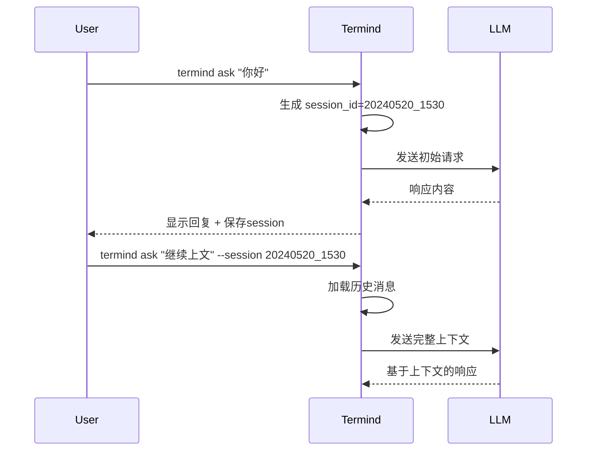

# Termind

  

[中文](README_zh.md) | [English](README.md)

Termind is a command line multi-model LLM fast testing tool.

## Session Management

```mermaid
sequenceDiagram
    participant User
    participant Termind
    participant LLM

    User->>Termind: termind ask "你好"
    Termind->>Termind: 生成 session_id=20240520_1530
    Termind->>LLM: 发送初始请求
    LLM-->>Termind: 响应内容
    Termind-->>User: 显示回复 + 保存session

    User->>Termind: termind ask "继续上文" --session 20240520_1530
    Termind->>Termind: 加载历史消息
    Termind->>LLM: 发送完整上下文
    LLM-->>Termind: 基于上下文的响应
```

